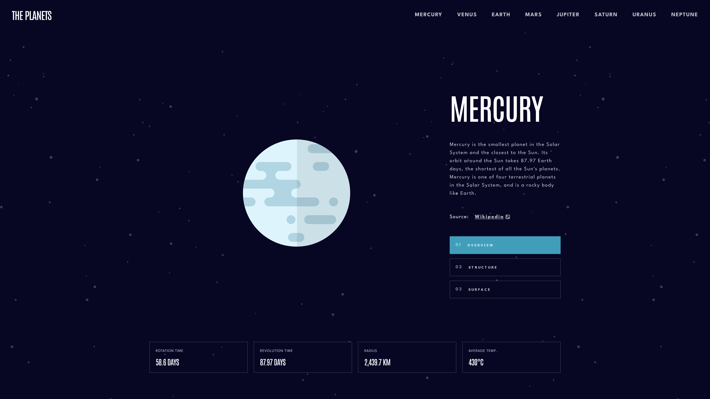
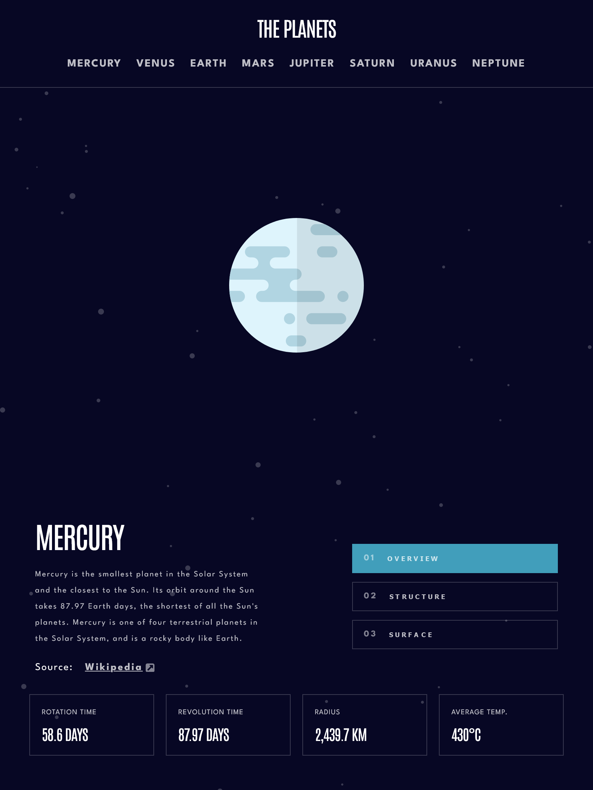
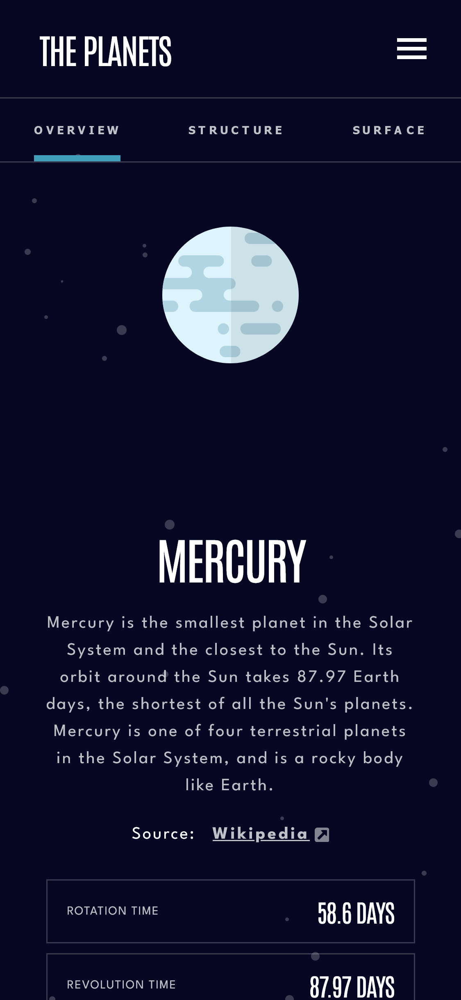

# Frontend Mentor - Planets app solution

This is a solution to the [Planets fact site on Frontend Mentor](https://www.frontendmentor.io/challenges/planets-fact-site-gazqN8w_fW).

## Table of contents

- [The challenge](#the-challenge)
- [Screenshot](#screenshot)
- [Links](#links)

## The challenge

Users should be able to:

- View the optimal layout for each of the website's pages depending on their device's screen size
- See hover states for all interactive elements on the page
- View each page and be able to toggle between the tabs to see new information

The solution was built using Solid.js, TypeScript and Sass.

## Screenshots

Screen:

Tablet:

Mobile:

## Links

- [GitHub Repo](https://github.com/ursasimenc/solid-planets)
- [Demo](https://solid-planets.netlify.app)
